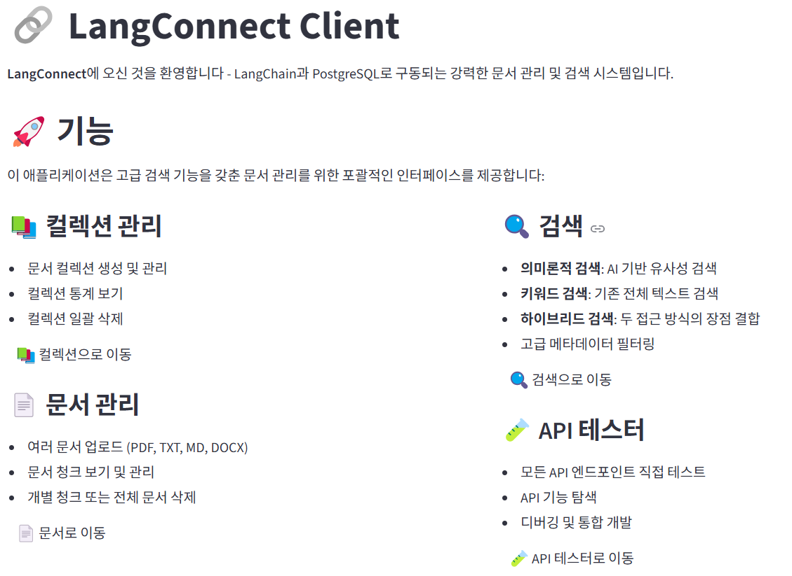
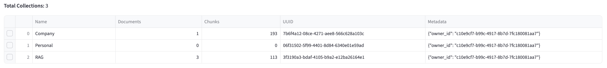
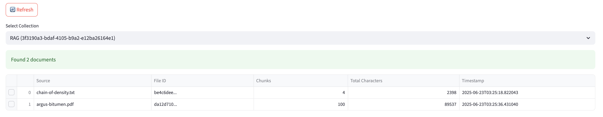
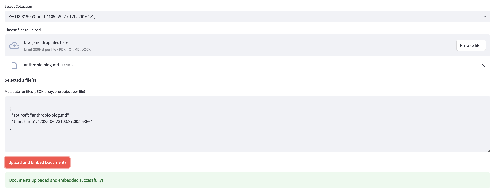
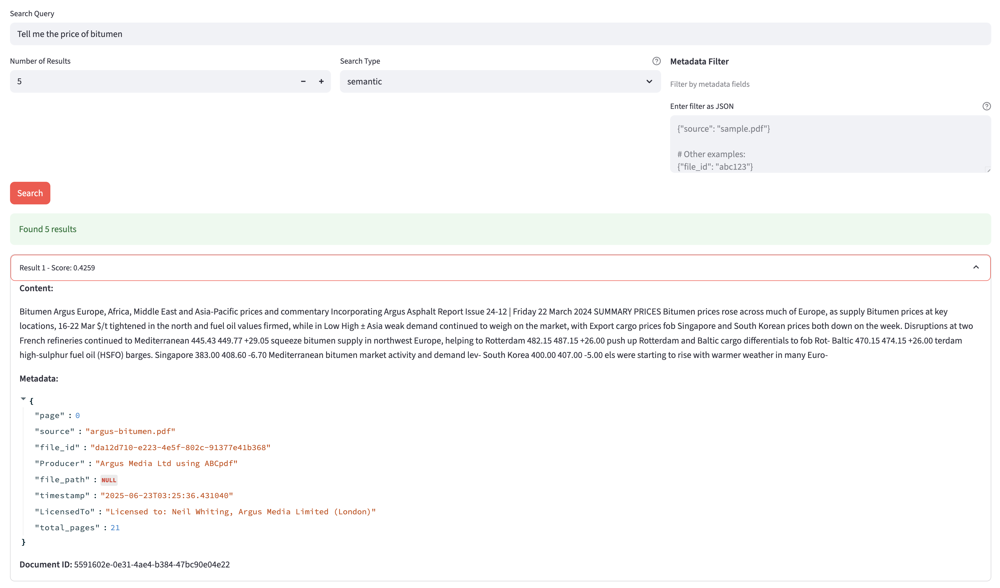
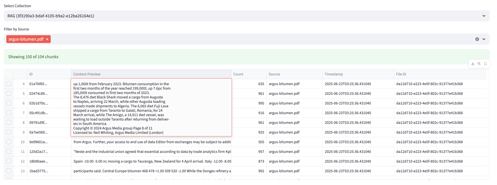

# LangConnect-Client

<div align="center">
  
  <p><em>실시간 문서 처리 및 검색 기능을 갖춘 RAG 시스템 관리를 위한 직관적인 대시보드</em></p>
</div>

LangConnect-Client는 Streamlit으로 구축된 포괄적인 RAG(검색 증강 생성) 클라이언트 애플리케이션입니다. LangConnect API와 상호 작용하기 위한 사용자 친화적인 인터페이스를 제공하여 pgvector 확장이 포함된 PostgreSQL로 구동되는 문서 관리 및 벡터 검색 기능을 활성화합니다.

## 🎯 주요 기능 소개

### 📚 컬렉션 관리
<div align="center">
  
  <p><em>즉시 삭제 기능으로 컬렉션을 관리하세요. 메타데이터 지원으로 문서 컬렉션을 생성 및 구성하고 자세한 통계를 확인하세요.</em></p>
</div>

### 📄 문서 관리
<div align="center">
  
  <p><em>직관적인 인터페이스로 문서를 보고 관리하세요. 청크 수 및 총 문자 수를 포함한 문서 수준 통계를 확인하고 다중 선택 삭제 기능을 사용하세요.</em></p>
</div>

<div align="center">
  
  <p><em>자동 메타데이터 생성 및 사용자 정의 옵션을 사용하여 다양한 형식(PDF, TXT, MD, DOCX)으로 여러 문서를 업로드하세요.</em></p>
</div>

### 🔍 벡터 검색
<div align="center">
  
  <p><em>다양한 검색 유형(의미론적, 키워드, 하이브리드)으로 고급 검색을 수행하세요. 메타데이터로 필터링하고 관련성 점수 및 소스 정보와 함께 결과를 확인하세요.</em></p>
</div>

### 🔬 청크 조사
<div align="center">
  
  <p><em>강력한 필터링 기능으로 문서 청크를 자세히 살펴보세요. 콘텐츠 미리보기, 문자 수 및 메타데이터를 포함한 자세한 청크 정보를 확인하세요.</em></p>
</div>

## 📋 목차

- [기능](#features)
- [아키텍처](#architecture)
- [시작하기](#getting-started)
  - [필수 조건](#prerequisites)
  - [Docker로 실행](#running-with-docker)
  - [개발 설정](#development-setup)
- [API 문서](#api-documentation)
  - [인증](#authentication)
  - [컬렉션](#collections)
  - [문서](#documents)
  - [검색](#search)
- [Streamlit 애플리케이션](#streamlit-application)
  - [주요 기능](#main-features)
  - [페이지 개요](#pages-overview)
  - [인증 유지](#authentication-persistence)
- [MCP (모델 컨텍스트 프로토콜) 서버](#mcp-model-context-protocol-server)
  - [사용 가능한 도구](#available-tools)
  - [구성](#configuration)
  - [Claude Desktop과 함께 사용](#usage-with-claude-desktop)
- [환경 변수](#environment-variables)
- [테스트](#testing)
- [보안](#security)
- [라이선스](#license)

## 기능

- **🚀 FastAPI 기반 REST API** (자동 문서화 포함)
- **🔐 Supabase 인증** (안전한 사용자 관리)
- **🐘 pgvector가 포함된 PostgreSQL** (효율적인 벡터 스토리지 및 유사성 검색)
- **📄 다중 형식 문서 지원** (PDF, TXT, MD, DOCX)
- **🔍 고급 검색 기능**:
  - 의미론적 검색 (벡터 유사성)
  - 키워드 검색 (전체 텍스트)
  - 하이브리드 검색 (두 가지 방법의 조합)
  - 메타데이터 필터링
- **🎨 Streamlit 웹 인터페이스** (쉬운 상호 작용)
- **🤖 MCP 서버 통합** (AI 어시스턴트 도구)
- **🐳 Docker 지원** (쉬운 배포)

## 아키텍처

```
┌─────────────────┐     ┌──────────────────┐     ┌─────────────────┐
│   Streamlit UI  │────▶│  FastAPI Server  │────▶│   PostgreSQL    │
│   (Frontend)    │     │  (Backend API)   │     │   + pgvector    │
└─────────────────┘     └──────────────────┘     └─────────────────┘
                               │
                               ▼
                        ┌──────────────────┐
                        │   Supabase Auth  │
                        └──────────────────┘
```

## 🚀 빠른 시작

단 3단계로 시작할 수 있습니다:

```bash
# 1. 저장소 복제
git clone https://github.com/EricSeokgon/LangConnect-Client.git
cd LangConnect-Client

# 2. 환경 변수 복사 및 구성
cp .env.example .env
# .env 파일을 편집하여 SUPABASE_URL 및 SUPABASE_KEY 추가

# 3. 모든 서비스 시작
docker compose up -d
```

시작되면 다음에 액세스할 수 있습니다:
- 🎨 **Streamlit UI**: http://localhost:8501
- 📚 **API 문서**: http://localhost:8080/docs
- 🔍 **상태 확인**: http://localhost:8080/health

모든 서비스를 중지하려면:
```bash
docker compose down
```

## 시작하기

### 필수 조건

- Docker 및 Docker Compose
- Python 3.11 이상
- Supabase 계정 (인증용)

### Docker로 실행

1. 저장소를 클론합니다:
   ```bash
   git clone https://github.com/EricSeokgon/LangConnect-Client.git
   cd LangConnect-Client
   ```

2. 구성으로 `.env` 파일 생성:
   ```bash
   # Supabase 구성
   SUPABASE_URL=https://your-project.supabase.co
   SUPABASE_KEY=your-anon-key

   # 데이터베이스 구성 (Docker 환경)
   POSTGRES_HOST=postgres
   POSTGRES_PORT=5432
   POSTGRES_USER=postgres
   POSTGRES_PASSWORD=postgres
   POSTGRES_DB=postgres

   # 인증
   IS_TESTING=false  # 인증 비활성화를 위해 true로 설정
   ```

3. 서비스를 시작합니다:
   ```bash
   docker-compose up -d
   ```

   이렇게 하면 다음이 시작됩니다:
   - pgvector 확장이 포함된 PostgreSQL 데이터베이스
   - http://localhost:8080에서 LangConnect API 서비스
   - http://localhost:8501에서 Streamlit UI

4. 서비스에 액세스:
   - API 문서: http://localhost:8080/docs
   - Streamlit UI: http://localhost:8501
   - 상태 확인: http://localhost:8080/health

### 개발 설정

Docker 없이 로컬 개발을 위해:

1. 환경 변수 설정 (`.env` 파일 생성):
   ```bash
   # Supabase 구성
   SUPABASE_URL=https://your-project.supabase.co
   SUPABASE_KEY=your-anon-key

   # 데이터베이스 구성 (로컬 개발)
   POSTGRES_HOST=localhost
   POSTGRES_PORT=5432
   POSTGRES_USER=langchain
   POSTGRES_PASSWORD=langchain
   POSTGRES_DB=langchain_test

   # Google Gemini API 키
   GOOGLE_API_KEY=your-gemini-api-key

   # 인증
   IS_TESTING=false  # 인증 비활성화를 위해 true로 설정
   ```

2. 종속성 설치:
   ```bash
   pip install -r requirements.txt
   ```

3. pgvector가 포함된 PostgreSQL 시작 (또는 데이터베이스만 Docker 사용):
   ```bash
   docker-compose up -d postgres
   ```

4. API 서버 실행:
   ```bash
   uvicorn langconnect.server:app --reload --host 0.0.0.0 --port 8080
   ```

5. Streamlit 앱 실행:
   ```bash
   streamlit run Main.py
   ```

## API 문서

API는 컬렉션 및 문서 관리를 위한 포괄적인 엔드포인트를 제공합니다. 전체 대화형 문서는 서비스가 실행 중일 때 http://localhost:8080/docs에서 확인할 수 있습니다.

### 인증

모든 API 엔드포인트 (/health 및 /auth/* 제외)는 `IS_TESTING=false`일 때 인증이 필요합니다.

#### 인증 엔드포인트

| 메서드 | 엔드포인트 | 설명 | 요청 본문 |
|--------|----------|-------------|--------------|
| POST | `/auth/signup` | 새 사용자 계정 생성 | `{"email": "user@example.com", "password": "password123"}` |
| POST | `/auth/signin` | 기존 계정으로 로그인 | `{"email": "user@example.com", "password": "password123"}` |
| POST | `/auth/signout` | 로그아웃 (클라이언트 측 정리) | - |
| POST | `/auth/refresh` | 액세스 토큰 갱신 | 쿼리 매개변수: `refresh_token` |
| GET | `/auth/me` | 현재 사용자 정보 가져오기 | - (인증 필요) |

요청에 액세스 토큰 포함:
```
Authorization: Bearer your-access-token
```

### 컬렉션

컬렉션은 관련 문서를 구성하기 위한 컨테이너입니다.

| 메서드 | 엔드포인트 | 설명 | 요청 본문 |
|--------|----------|-------------|--------------|
| GET | `/collections` | 모든 컬렉션 목록 | - |
| POST | `/collections` | 새 컬렉션 생성 | `{"name": "collection-name", "metadata": {}}` |
| GET | `/collections/{collection_id}` | 컬렉션 세부정보 가져오기 | - |
| PATCH | `/collections/{collection_id}` | 컬렉션 업데이트 | `{"name": "new-name", "metadata": {}}` |
| DELETE | `/collections/{collection_id}` | 컬렉션 삭제 | - |

### 문서

문서는 효율적인 검색을 위해 청크로 저장되며 임베딩이 포함됩니다.

| 메서드 | 엔드포인트 | 설명 | 매개변수 |
|--------|----------|-------------|------------|
| GET | `/collections/{collection_id}/documents` | 문서 목록 | `limit`, `offset` |
| POST | `/collections/{collection_id}/documents` | 문서 업로드 | 양식 데이터: `files[]`, `metadatas_json` |
| DELETE | `/collections/{collection_id}/documents/{document_id}` | 문서 삭제 | 쿼리 매개변수: `delete_by` (document_id/file_id) |

### 검색

컬렉션 내에서 고급 검색 기능.

| 메서드 | 엔드포인트 | 설명 | 요청 본문 |
|--------|----------|-------------|--------------|
| POST | `/collections/{collection_id}/documents/search` | 문서 검색 | `{"query": "search text", "limit": 10, "search_type": "semantic", "filter": {}}` |

검색 유형:
- `semantic`: 임베딩을 사용한 벡터 유사성 검색
- `keyword`: 전통적인 전체 텍스트 검색
- `hybrid`: 의미론적 검색과 키워드 검색의 조합

필터 예시:
```json
{
  "query": "machine learning",
  "limit": 5,
  "search_type": "hybrid",
  "filter": {
    "source": "research_paper.pdf",
    "type": "academic"
  }
}
```

## Streamlit 애플리케이션

Streamlit 애플리케이션은 LangConnect API와 상호 작용하기 위한 사용자 친화적인 웹 인터페이스를 제공합니다.

### 주요 기능

- **사용자 인증**: 회원 가입, 로그인 및 지속적인 세션
- **컬렉션 관리**: 컬렉션 생성, 보기 및 삭제
- **문서 업로드**: 메타데이터가 포함된 배치 문서 업로드
- **문서 관리**: 문서 보기, 검색 및 삭제
- **고급 검색**: 의미론적, 키워드 및 하이브리드 검색과 필터
- **API 테스트**: 개발을 위한 내장 API 테스터

### 페이지 개요

1. **Main.py** - 랜딩 페이지로 프로젝트 개요 및 탐색 제공
   - 프로젝트 정보 및 기능
   - 모든 페이지에 대한 빠른 링크
   - 사용자 인증 상태

2. **컬렉션 페이지** (`pages/1_Collections.py`)
   - **목록 탭**: 모든 컬렉션 보기 및 문서/청크 수
   - **생성 탭**: 메타데이터가 있는 새 컬렉션 생성
   - 다중 선택을 통한 일괄 삭제
   - 자동 통계 계산

3. **문서 페이지** (`pages/2_Documents.py`)
   - **업로드 탭**:
     - 배치 파일 업로드 (PDF, TXT, MD, DOCX)
     - 자동 메타데이터 생성
     - 사용자 정의 메타데이터 지원
   - **목록 탭**:
     - file_id별로 그룹화된 문서 수준 보기
     - 문서당 총 문자 수 및 청크 수
     - file_id별 다중 선택 삭제
   - **청크 탭**:
     - 콘텐츠 미리보기가 있는 개별 청크 보기
     - 소스별 다중 선택 필터링
     - 문자 수 표시
     - 청크 수준 삭제

4. **검색 페이지** (`pages/3_Search.py`)
   - 컬렉션 선택
   - 검색 유형 선택 (의미론적/키워드/하이브리드)
   - JSON 메타데이터 필터링
   - 관련성 점수가 있는 결과 표시
   - 필터링을 위한 소스 미리보기

5. **API 테스터 페이지** (`pages/4_API_Tester.py`)
   - 대화형 API 엔드포인트 테스트
   - 기능별 그룹화
   - 요청/응답 시각화
   - 인증 토큰 관리

### 인증 유지

Streamlit 앱은 다음을 통해 지속적인 인증을 지원합니다:

1. **자동 파일 기반 저장** (기본값)
   - 토큰이 `~/.langconnect_auth_cache`에 저장됨
   - 7일 동안 유효
   - 재시작 시 자동으로 로드

2. **환경 변수** (선택 사항)
   ```bash
   LANGCONNECT_TOKEN=your-access-token
   LANGCONNECT_EMAIL=your-email@example.com
   ```

## MCP (모델 컨텍스트 프로토콜) 서버

LangConnect에는 Claude와 같은 AI 어시스턴트가 문서 컬렉션과 프로그래밍 방식으로 상호 작용할 수 있도록 하는 두 가지 MCP 서버 구현이 포함되어 있습니다:

1. **표준 MCP 서버** - 직접 통합을 위한 stdio 전송 사용
2. **SSE MCP 서버** - 웹 기반 통합을 위한 서버 전송 이벤트 사용 (포트 8765에서 실행)

### 사용 가능한 도구

MCP 서버는 포괄적인 문서 관리를 위한 9가지 도구를 제공합니다:

1. **search_documents** - 의미론적, 키워드 또는 하이브리드 검색 수행
2. **list_collections** - 사용 가능한 모든 컬렉션 목록
3. **get_collection** - 특정 컬렉션에 대한 세부정보 가져오기
4. **create_collection** - 새 컬렉션 생성
5. **delete_collection** - 컬렉션 및 해당 문서 삭제
6. **list_documents** - 컬렉션 내 문서 목록
7. **add_documents** - 메타데이터가 있는 텍스트 문서 추가
8. **delete_document** - 특정 문서 삭제
9. **get_health_status** - API 상태 확인

### 구성

#### 1단계: 인증 및 구성

먼저, 인증하고 MCP 구성을 생성해야 합니다:

```bash
# 자동 인증으로 MCP 구성 생성
uv run mcp/create_mcp_json.py
```

이 명령은 다음을 수행합니다:
1. 이메일과 비밀번호를 입력하라는 메시지를 표시
2. Supabase 액세스 토큰을 자동으로 가져옴
3. 새 액세스 토큰으로 `.env` 파일 업데이트
4. 모든 필수 설정이 포함된 `mcp/mcp_config.json` 생성

⚠️ **중요**: Supabase 액세스 토큰은 약 1시간 후에 만료됩니다. 토큰이 만료되면 이 명령을 다시 실행해야 합니다.

#### 2단계: SSE 서버 실행

로컬에서 MCP SSE 서버를 실행하려면:

```bash
# SSE 서버 시작
uv run mcp/mcp_sse_server.py
```

서버가 `http://localhost:8765`에서 시작되고 다음이 표시됩니다:
- 서버 시작 확인
- MCP 클라이언트 전용 (브라우저에서 액세스 불가)

#### 3단계: MCP 인스펙터로 테스트

MCP 인스펙터를 사용하여 MCP 서버를 테스트할 수 있습니다:

```bash
# MCP 인스펙터로 테스트
npx @modelcontextprotocol/inspector
```

인스펙터에서:
1. 전송 유형으로 "SSE" 선택
2. URL로 `http://localhost:8765` 입력
3. 연결 및 사용 가능한 도구 테스트

#### Claude Desktop과 함께 사용

생성된 `mcp/mcp_config.json` 파일의 내용을 복사하여 Claude Desktop MCP 설정에 붙여넣기만 하면 LangConnect 도구를 즉시 사용할 수 있습니다.

#### 표준 MCP 서버 수동 구성

또는 `mcp/mcp_config.json`에서 MCP 서버를 수동으로 구성할 수 있습니다:

```json
{
  "mcpServers": {
    "langconnect-rag-mcp": {
      "command": "/path/to/python",
      "args": [
        "/path/to/langconnect/mcp/mcp_server.py"
      ],
      "env": {
        "API_BASE_URL": "http://localhost:8080",
        "SUPABASE_ACCESS_TOKEN": "your-jwt-token-here"
      }
    }
  }
}
```

#### SSE MCP 서버 구성

웹 기반 통합을 위한 SSE 전송의 경우:

```json
{
  "mcpServers": {
    "langconnect-rag-sse": {
      "url": "http://localhost:8765",
      "transport": "sse"
    }
  }
}
```

SSE 서버는 다음을 제공합니다:
- **기본 URL**: http://localhost:8765
- **전송**: 서버 전송 이벤트 (SSE)
- **CORS 지원**: 웹 통합을 위한 활성화

### 인증

두 MCP 서버 모두 Supabase JWT 인증이 필요합니다. 가장 쉬운 인증 방법은 위에 설명된 대로 `create_mcp_json.py` 스크립트를 사용하는 것입니다. 이 스크립트는 다음을 수행합니다:
- 액세스 토큰을 자동으로 가져옴
- `.env` 파일 업데이트
- MCP 구성 생성

#### 수동 토큰 검색 (대안)

액세스 토큰을 수동으로 가져와야 하는 경우:

1. http://localhost:8501에서 Streamlit UI에 로그인
2. 브라우저 개발자 도구 열기 (F12) → 응용 프로그램/저장소 → 세션 저장소
3. `access_token` 값을 찾아 복사
4. 구성에서 `SUPABASE_ACCESS_TOKEN`으로 설정

⚠️ **토큰 만료**: Supabase 액세스 토큰은 약 1시간 후에 만료됩니다. 토큰이 만료되면 `uv run mcp/create_mcp_json.py`를 다시 실행하여 새 토큰을 가져옵니다.

### Claude Desktop과 함께 사용

1. Supabase 액세스 토큰 가져오기 (위의 인증 참조)
2. 경로 및 토큰으로 구성 파일 업데이트
3. Claude Desktop의 MCP 설정에 구성 추가
4. Claude는 문서 관리 및 검색을 위한 모든 LangConnect 도구에 액세스할 수 있습니다

Claude에서의 예시 사용:
- "내 연구 컬렉션에서 머신 러닝에 대한 문서 검색"
- "프로젝트 문서화라는 이름의 새 컬렉션 만들기"
- "technical-specs 컬렉션의 모든 문서 나열"

## 환경 변수

| 변수 | 설명 | 기본값 | 필수 |
|----------|-------------|---------|----------|
| **인증** |
| SUPABASE_URL | Supabase 프로젝트 URL | - | 예 |
| SUPABASE_KEY | Supabase 익명 키 | - | 예 |
| IS_TESTING | 테스트를 위한 인증 비활성화 | false | 아니요 |
| LANGCONNECT_TOKEN | 지속적인 인증 토큰 | - | 아니요 |
| LANGCONNECT_EMAIL | 지속적인 인증 이메일 | - | 아니요 |
| **데이터베이스** |
| POSTGRES_HOST | PostgreSQL 호스트 | postgres | 아니요 |
| POSTGRES_PORT | PostgreSQL 포트 | 5432 | 아니요 |
| POSTGRES_USER | PostgreSQL 사용자 이름 | postgres | 아니요 |
| POSTGRES_PASSWORD | PostgreSQL 비밀번호 | postgres | 아니요 |
| POSTGRES_DB | PostgreSQL 데이터베이스 이름 | postgres | 아니요 |
| **API** |
| API_BASE_URL | API 기본 URL | http://localhost:8080 | 아니요 |
| **MCP SSE 서버** |
| SSE_PORT | MCP SSE 서버 포트 | 8765 | 아니요 |
| SUPABASE_ACCESS_TOKEN | Supabase 인증을 위한 JWT 토큰 | - | 예 (MCP용) |

## 테스트

테스트 스위트 실행:

```bash
# 인증 테스트
python test_supabase_auth.py

# API 엔드포인트 테스트
python test_auth.py
python test_retrieval_endpoint.py

# MCP 기능 테스트
python test_mcp_metadata.py
```

## 보안

1. **인증**: 모든 API 엔드포인트는 유효한 JWT 토큰이 필요합니다 (상태 확인 제외)
2. **토큰 관리**: 토큰은 만료되며 갱신이 필요합니다
3. **환경 보안**: `.env` 파일을 커밋하거나 키를 노출하지 마세요
4. **CORS**: 프로덕션에서 허용된 출처 구성
5. **데이터베이스**: 강력한 비밀번호 사용 및 접근 제한

## 라이선스

이 프로젝트는 저장소에 포함된 조건에 따라 라이선스가 부여됩니다.

---

❤️로 만들어졌습니다 by [TeddyNote LAB](https://github.com/teddynote-lab)
